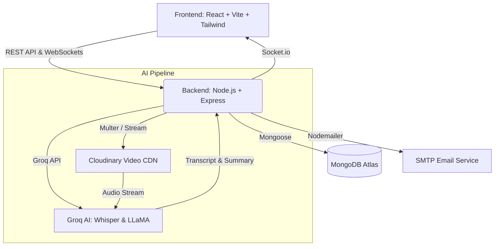

<div align="center">
  <!-- TODO: Add Logo here -->
  <!--  -->

  <h1>SyncLoop ⚡</h1>

  <p>
    <strong>The asynchronous video communication platform built for high-performance, distributed teams.</strong>
  </p>

  <p>
    <a href="#features">Features</a> •
    <a href="#security--architecture">Security</a> •
    <a href="#screenshots">Screenshots</a> •
    <a href="#getting-started">Getting Started</a> •
    <a href="#deployment">Deployment</a>
  </p>
</div>

---

SyncLoop replaces endless live meetings with structured, asynchronous video threads. Record your updates, watch them on your own time, and let **Groq AI** automatically transcribe and summarize the key takeaways.

## ✨ Features

- 📹 **Asynchronous Video Threads:** Record webcam/screen updates directly from the browser. Watch replies in context.
- 🤖 **Groq AI Integration:** Every video is automatically transcribed using `whisper-large-v3` and summarized with `llama-3.3-70b-versatile` via the Grok API.
- 💬 **Meeting Chat AI:** Ask the AI questions about the meeting ("What was the consensus on the new design?" or "List my action items").
- 🏢 **Secure Workspaces:** Create private team workspaces, invite members, and maintain role-based access to meeting threads.
- 🧵 **Threaded Discussions:** Deeply nested text comments on specific video replies.
- 📬 **Email Notifications:** Automated alerts sent to team members when a new update is posted.
- 🎨 **Beautiful UI:** Built with Tailwind CSS and inspired by modern premium SaaS design.
- 🌙 **Dark Mode:** Native, flicker-free dark mode support.

---

## 🔒 Security & Architecture

SyncLoop is built with **enterprise-grade security** and modern, decoupled architecture. 

### Security Highlights
- **Zero Trust Architecture:** Socket.io connections and REST API routes are fully secured with JWT authentication and deep workspace-membership validation.
- **Attack Prevention:** Protected against NoSQL Injection, ReDoS, XSS, and Clickjacking via aggressive input sanitization, strict Mongoose schema limits, and `helmet` headers.
- **DDoS Mitigation:** Layered rate-limiting strategy (Global 200/15m, Auth 10/15m) and JSON body payload size limits.
- **Cost Control:** Cloudinary assets are automatically destroyed upon user account or video deletion.

### Infrastructure


---

## 📸 Screenshots

> **Note:** Screenshots will be added here following production deployment.

<!-- TODO: Add Screenshots here after deployment -->
<!-- 
### Dashboard


### Video Recording & Thread


### Dark Mode
 
-->

---

## 🛠️ Tech Stack

### Frontend
- **Framework:** React 19 + Vite
- **Routing:** React Router v7
- **Styling:** Tailwind CSS v3 + Lucide Icons
- **State Management:** React Hooks + LocalStorage
- **Data Visualization:** Recharts
- **Real-time:** Socket.io-client

### Backend
- **Server:** Node.js + Express
- **Database:** MongoDB + Mongoose
- **Authentication:** JWT + bcryptjs
- **Security:** Helmet + express-rate-limit
- **Media Storage:** Cloudinary
- **AI Processing:** Groq SDK
- **Testing:** Jest + Supertest

---

## 🚀 Getting Started

### Prerequisites
- Node.js (v18+)
- MongoDB Atlas URI
- Cloudinary Account
- Groq API Key

### Local Setup

**1. Clone the repository**
```bash
git clone https://github.com/vineet765245/syncloop.git
cd syncloop
```

**2. Setup Backend**
```bash
cd backend
npm install
```
Create a `.env` file in the `backend` directory:
```env
PORT=5000
MONGODB_URI=your_mongodb_connection_string
JWT_SECRET=your_jwt_secret
CLOUDINARY_CLOUD_NAME=your_cloud_name
CLOUDINARY_API_KEY=your_api_key
CLOUDINARY_API_SECRET=your_api_secret
GROQ_API_KEY=your_grok_api_key
EMAIL_USER=your_email@gmail.com
EMAIL_PASS=your_app_password
CORS_ORIGIN=http://localhost:5173
```
Start the server:
```bash
npm start
```

**3. Setup Frontend**
```bash
cd ../frontend
npm install
```
Create a `.env` file in the `frontend` directory:
```env
VITE_API_URL=http://localhost:5000
```
Start the client:
```bash
npm run dev
```

The app will be available at `http://localhost:5173`.

---

## 🧪 Testing

The backend includes a comprehensive Jest test suite covering authentication, authorization, and core application logic.

```bash
cd backend
npm run test
```

---

## 📦 Deployment

SyncLoop is fully configured for modern PaaS deployment.

- **Frontend (Vercel/Netlify):** Built with Vite. Make sure to set the `VITE_API_URL` environment variable to point to your live backend server.
- **Backend (Render/Heroku):** Standard Node.js backend. Ensure all environment variables (including `CORS_ORIGIN` pointing to your frontend URL) are securely injected.

---

## 🤝 Contributing

Contributions, issues, and feature requests are welcome! Feel free to check the [issues page](https://github.com/vineet765245/syncloop/issues).

---

<div align="center">
  Built with ❤️ by <a href="mailto:vineet765245@gmail.com">Vineet Kumar</a>.
</div>
